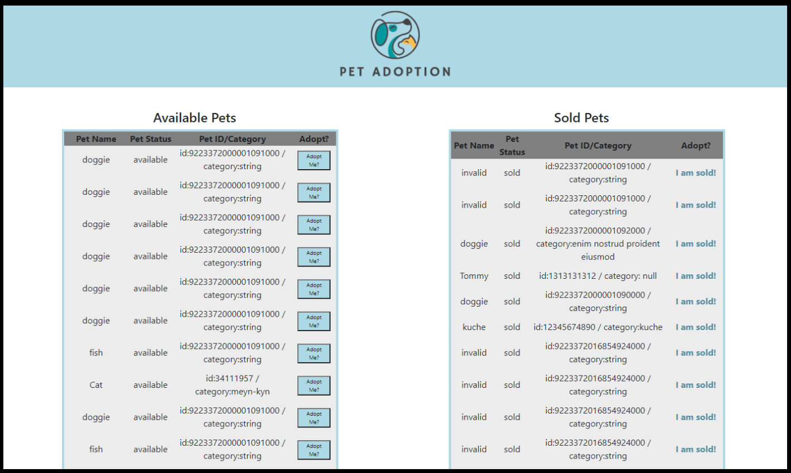

## How to load:
This project was bootstrapped with [Create React App](https://github.com/facebook/create-react-app).

**install dependencies**
npm install axios

**From root folder:**
npm start

## The challenge:

Using Swagger.io's Petstore API, create a web app using React or Vue that shows all available pets in a table that displays name, category, and status along with a button to change the status to “sold”.

**Requirements:**
As a user, I need to view all “available” pets in a table which show display name, category, and status along with a button to change the pet status to “sold”.
As a user, I need the ability to change the status of a pet from “available” to “sold”.
As a user, I need to be able to view “sold” pets to confirm the updated status.

## lessons learned/next steps:

This was my first time interacting with Swagger.io. I enjoyed digging in and learning more about how React components are connected, learning how to use State/Props, and getting the data to render correctly after sending a PUT request to the API. If given more time, I would research ways to make the UI show that the status of the pet is "Sold" immediately without a delay and having to refresh the page. Also, for a cleaner UI, I would also limit the amount of available pets that are being returned from the API, and also disable the ability to click the Adopt button more than once.
